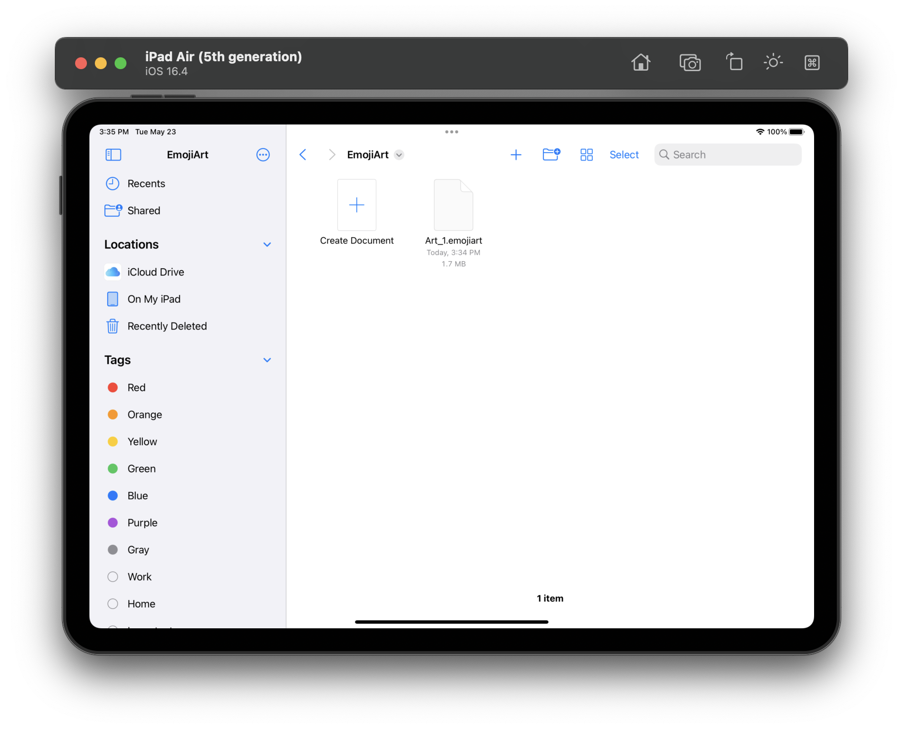
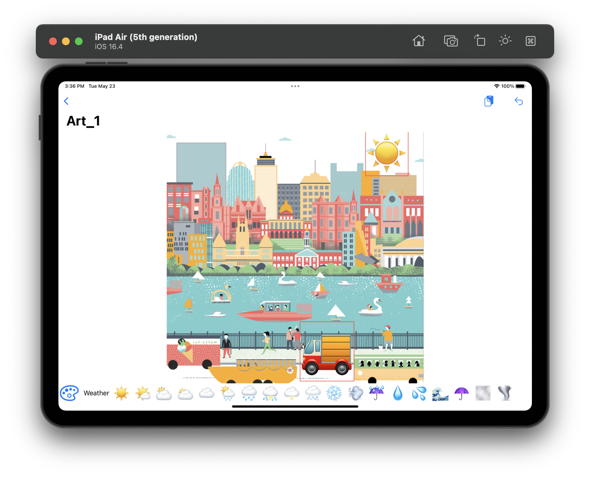
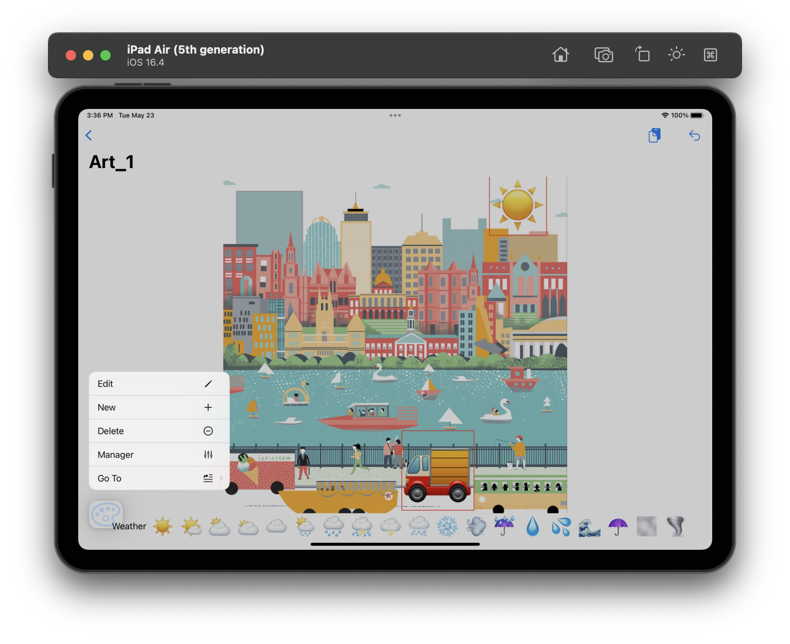
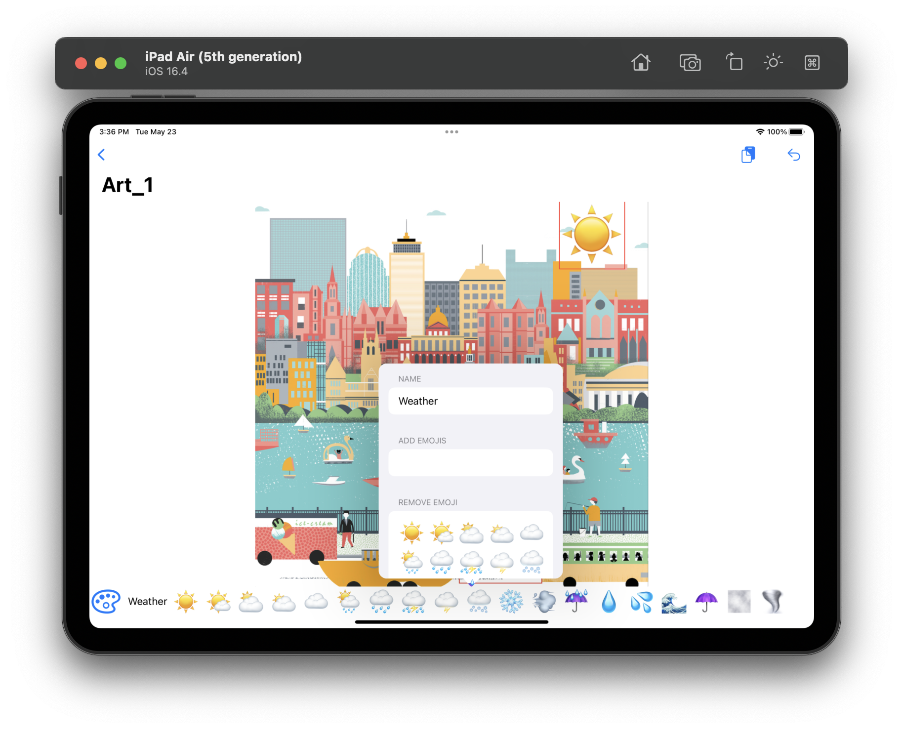
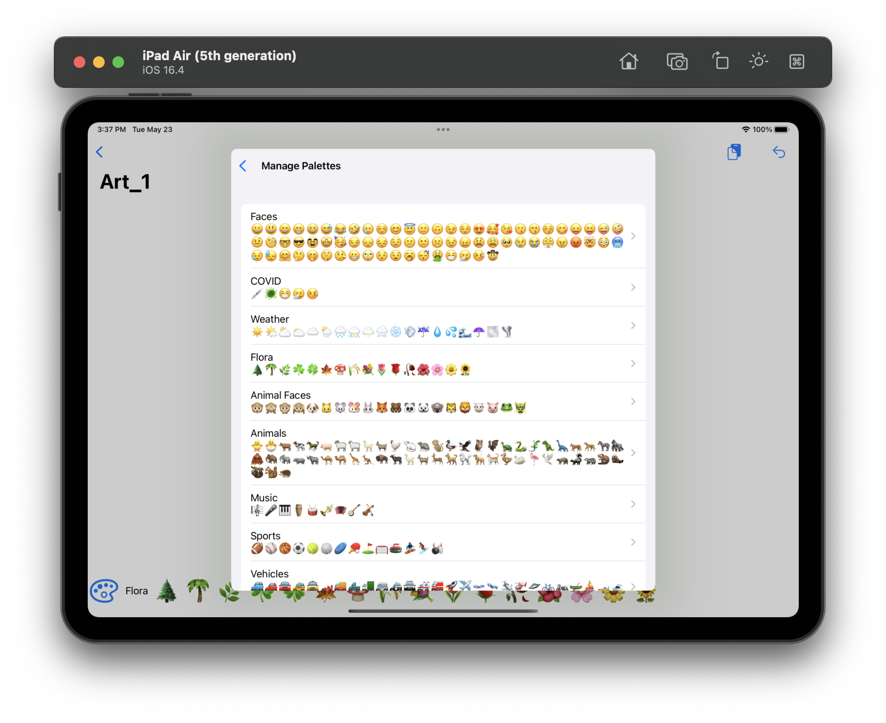

# EmojiArt app

## Description

EmojiArt is an app that allows you to add emojis to images. It provides a bunch of editable themes. You can create your own. You can add an Image with drag-and-drop or paste it. On the iPhone, you can use the camera to take the image for the background. The documents are saved in their custom format.

The app uses Scene to show the DocumentGroup.

## Technologies the app uses

<ul>
    <li>Swift</li>
    <li>SwiftUI</li>
    <li>Combine</li>
    <li>UniformTypeIdentifiers</li>
</ul>

## Interface

    
    <em>You can choose the document or create a new one</em>

    
    <em>You can add emojis, move them, recise or delete</em>

    
    <em>Menue to manage the palette</em>

    
    <em>You can edit cuttent theme</em>

    
    <em>You can delete the theme here or open the editor</em>

